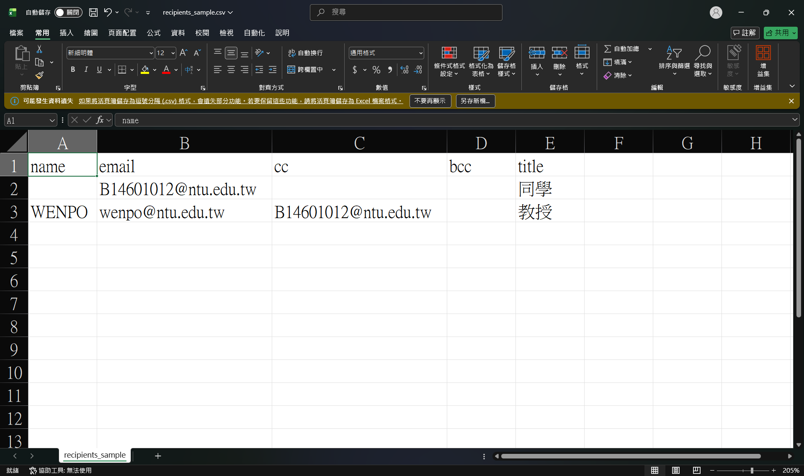
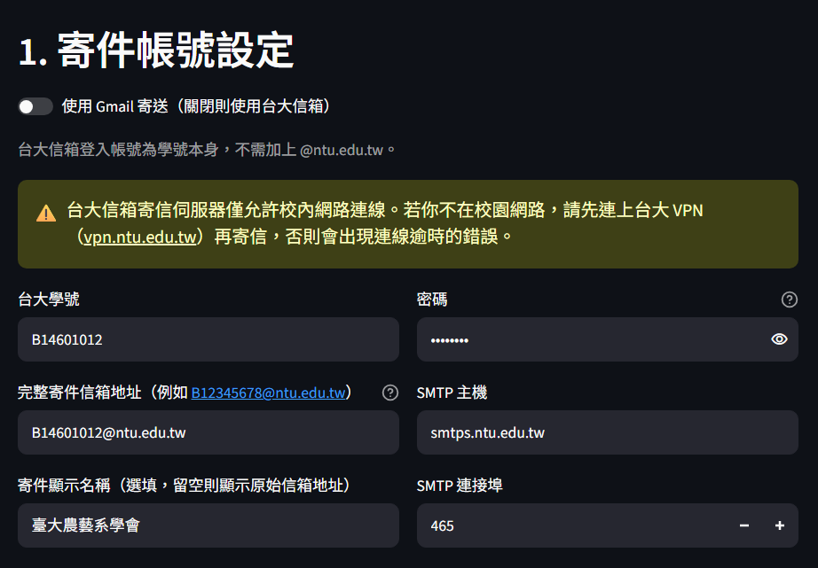
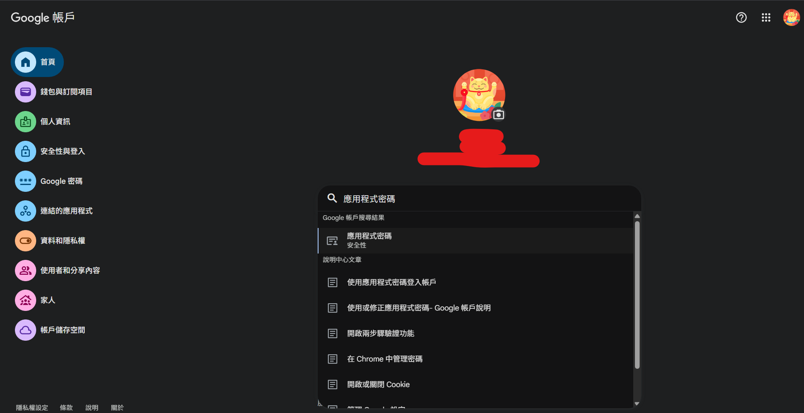

# NTU Mailer 使用教學

這份教學說明如何準備收件人 CSV 檔案，以及如何設定寄件帳號。

## 一、下載並填寫收件人 CSV

1. 在網頁介面「2. 收件人清單」區塊，點擊「下載範例 CSV」
2. 用 Excel 或記事本開啟後，依照以下欄位填寫：

| 欄位 | 是否必填 | 說明 |
|---|---|---|
| `name` | 必填 | 收件人姓名，內文可用 `$name` 替換 |
| `email` | 必填 | 收件人信箱。**若對方是台大信箱，可以只填學號，不用打 `@ntu.edu.tw`** |
| `cc` | 選填 | 副本信箱，多筆用空格分隔 |
| `bcc` | 選填 | 密件副本信箱，多筆用空格分隔 |

*（此處放置 CSV 在 Excel 中的填寫範例截圖）*

3. 存檔時請選擇「CSV（逗號分隔）」格式，副檔名為 `.csv`

## 二、設定寄件帳號

### 使用台大信箱寄送

1. 確認網頁上方的 Gmail 開關是**關閉**狀態
2. 「台大學號」欄位只需輸入學號本身，例如 `B12345678`，不要加 `@ntu.edu.tw`

*（此處放置台大信箱設定區塊的截圖）*

> ⚠️ **重要提醒**：台大信箱的寄信伺服器（SMTP）只允許**校內網路**或**已連接台大 VPN** 的裝置連線。
> 若你人在校外（家裡、外面店家等），請先連上台大 VPN（[vpn.ntu.edu.tw](https://vpn.ntu.edu.tw)）再使用本工具寄信，否則會出現連線逾時的錯誤。

### 使用 Gmail 寄送

1. 打開網頁上方的 Gmail 開關
2. 需先在 Google 帳戶開啟兩步驟驗證，並產生「應用程式密碼」（不是一般登入密碼）
3. 「Gmail 完整信箱地址」欄位填完整信箱，例如 `yourname@gmail.com`

*（此處放置 Google 帳戶產生應用程式密碼的步驟截圖）*

## 三、寄送流程

1. 上傳填好的 CSV
2. 填寫信件主旨與內文
3. **務必先按「測試寄送」**，確認格式、內文變數替換、附件都正確
4. 確認無誤後，勾選確認框，按「正式寄送」
5. 寄送完成後，畫面會提供寄件記錄檔案供下載，可保留作為備份

---

若使用上遇到問題，請聯繫系學會資訊部門。
